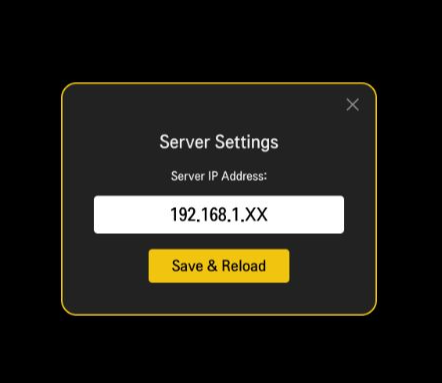
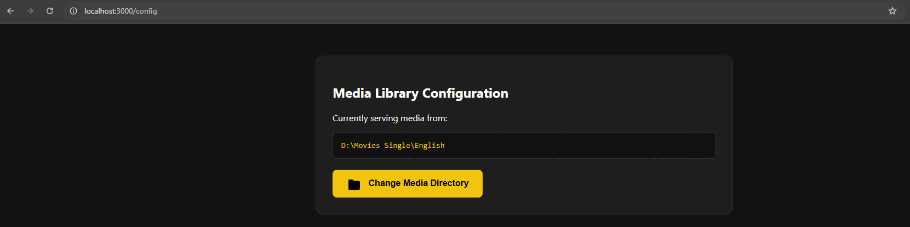
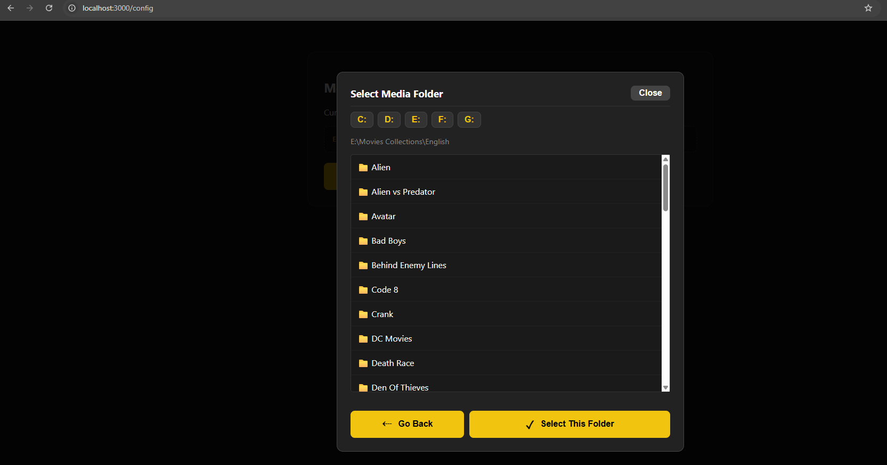

# WebOS Media Player & Server 🎬

A lightweight, open-source solution for streaming your local high-quality media library (MP4, MKV, AVI) directly from your computer to an LG WebOS TV. This project is designed for enthusiasts who want a premium, high-performance alternative to heavy media servers, with a specific focus on custom subtitle rendering and local network speed.

## 🌟 Introduction

This project consists of two core components:
1.  **The Server:** A Node.js/Express backend that crawls your local drives (including external drives), handles video streaming with range-request support (for seeking), and manages dynamic directory configuration.
2.  **The Media Player:** A custom WebOS application built for LG TVs (like the OLED C5) that provides a "Netflix-style" interface to browse and play your content.

### 🔠 Customizable Subtitle Fonts
Unlike standard players, this system is built with a focus on regional language support. You can inject **customizable fonts** (e.g., Sinhala, Tamil, or custom stylized fonts) into the player. This ensures that subtitles are rendered with perfect kerning and clarity, overcoming the limitations of default TV system fonts.

---

## 💻 The Server

The server acts as the \"Bridge\" between your media storage and your TV.

### 📋 Pre-requisites
- **Node.js:** v16.x or higher installed on your host laptop/PC/NAS.
- **NPM:** (Included with Node.js).
- **Local Network:** Both the TV and the Server must be on the same Wi-Fi/LAN.

### 🛠️ Technologies Used
- **Runtime:** Node.js
- **Framework:** Express.js
- **File System:** Node `fs` API for recursive directory crawling.
- **Protocol:** HTTP with Range Header support (essential for 4K seeking).

### 🚀 How to Run
1. Navigate to the `src/server` directory:
2. Install dependencies:
 - `npm install`
3. Start the server:
 - `node server.js`
4. Access the configuration UI at `http://localhost:3000/config` to select your media drive.

## 📺 The Player (WebOS App)

The player is a dedicated WebOS application designed to run natively on your LG TV.

### 1. Developer Mode Setup
To install custom apps on WebOS, you must enable Developer Mode:
1. Install the **Developer Mode** app from the LG Content Store on your TV.
2. Log in with your LG Developer account credentials.
3. Turn on **Dev Mode Status** and **Key Server**.
4. **Note your TV's IP Address and the 6-digit Passphrase** displayed in the app.

### 2. Installation via VS Code
1. Install the **webOS TV 24 Extension** (by LG Electronics) in VS Code.
2. Open the `src/client` folder in your VS Code workspace.
3. Click the **webOS TV icon** in the VS Code Activity Bar (left side).
4. Click the **+** icon to add a new device:
   - Select **"LG WebOS TV"**.
   - Enter the **IP Address** from your TV.
   - Give it a name (e.g., "Living Room C5").
5. Right-click your new device and select **"Request Key"**. Enter the **Passphrase** from the TV app.
6. Once connected (green light), right-click the device again and select **"Install App"**.
7. Select the folder containing your `appinfo.json`.
8. The **WebOS Media Player** icon will now appear in your TV's home launcher.

---

## ⚙️ Configuration & Usage

- **Connecting the Player:** Once the app is open on your TV, it will look for the server at your computer's IP address on port `3000`.
  - Enter the server IP address.
    - 
- **Directory Selection:** Use the web-based config tool (`http://localhost:3000/config`) to jump between drive letters (C:, D:, E:) and select your media folder.
  - Click on `Change Media Directory` button.
    - 
  - Select drive and then media folder.
    - 
- **System Folders:** The server is hardcoded to ignore `$RECYCLE.BIN` and `System Volume Information` to avoid permission (EPERM) crashes on external drives. Therefor avoid using the root drive (eg: C:) as the media serving folder.